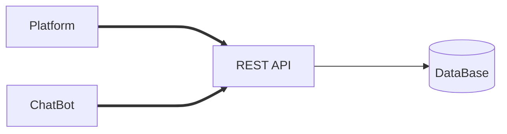
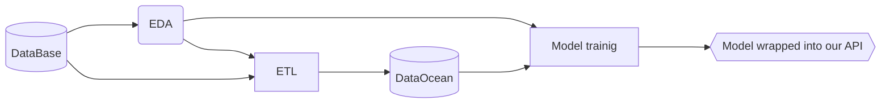

# Mental Health Analysis in Tech

source: https://osmihelp.org/research
final report: [R report](https://htmlpreview.github.io/?https://raw.githubusercontent.com/ElijahOzhmegov/mental_health_analysis/master/main.html)

## Business Value section
report: [html report](https://htmlpreview.github.io/?https://raw.githubusercontent.com/ElijahOzhmegov/mental_health_analysis/master/README.html)

Here will be presented Technical Design and Implementation. 

### Data journey: the 1st stage

Definitely a continuous process during the entire first stage.

Explanation:

* **Platform** is a web site where employees can fill in data. 
* **ChatBot** is a simple chat assistant that allows to fill in questionnaire (Slack, Rocketchat or Jira). 
* **REST API**  is an API that handles requests and puts them into our AWS DataBase.
* **DataBase** is a data base where all our data kept until further steps are taken (PostgreSQL).

### Data journey: the 2st stage (final)

A iterative process during the entire second stage.

Explanation:

* **EDA** - explanation data analysis, includes model search. It is expected to update ETL and the Model manually.
* **ETL** - Extract, Transform and Load to another data base that we call "DataOcean".
* **DataOcean** - a data base where we keep data prepared for Model training.
* **Model Training** - training model based on the entire data.

### Technology stack

Data Science:
* R - data analysis 
* Python due to NLP actions 

Data Engineering:
* SQL (PostgreSQL, Redshift)
* AWS 

Web:
* Bootstrap
* Django/Flask

| Employee | Requirements | Salary |
| ---- | ---- | ---- |
| Data Scientist | R (tidyverse, tidymodels, recipes), Python (NLTK, CoreNLP), REST API, Linux, AWS, SQL (Redshift, PostgreSQL)| 100 |
| Data/DevOps Engineer | Kafka/Spark, CI/CD, SQL (Redshift, PostgreSQL), Linux, Python, AWS,  REST API | 60 |
| Django Developer | Django (Flask), Bootstrap, AWS Linux, REST API | 60 |

| Technology | Volume | Total Price |
| ---- | ---- | ---- |
| domain name | 1 | 20 EUR/year |
| hosting | 3 | 30 EUR/month |
| DataBase | 2 (30GB each) | 3000 EUR/month |
| RStudio Connect | 1 (APIs, RMarkdown, EDA) | 1700 EUR/month |

